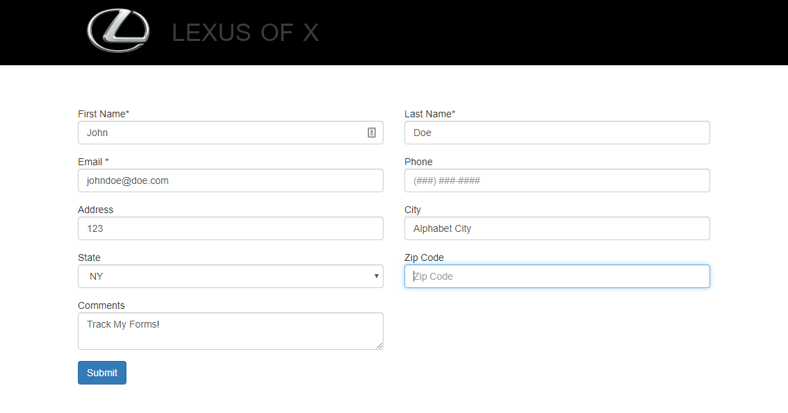
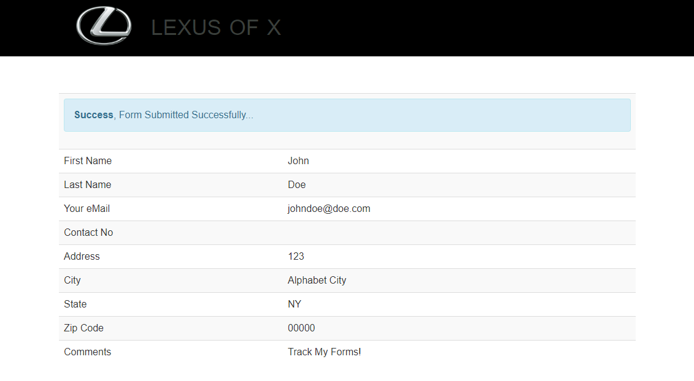

# LX-Tag-Manager-Forms

 

### Behind the scenes

Around the end of 2016, I started working for multiple marketing agencies, At first glance, i though it would be a cool gig, and something quite different from my comfort zone. The surprise was when i got to realize how much data is saved from forms on a regular basis. This project is quite simple, It's only integrates a form, with validation on standard JS, and PHP only for markups of sections.

This template in a way worked has boiler-plate to get all dealership forms started, the thing about this development was the communication between Google Tag Manager, and a `Basic Form`.

On the backend of the Google Tag Manager, there was a script that will cloneDeep/Copy every single form filled and send it to the company DB. The forms were place in each client site. Over 1000+ Dealerships across the state... Then you can imagine what was done with the information gather......

Yes, i didnt last too long in that place...

### Legacy Dependencies :

1) PHP
2) Grunt
2) Bootstrap 
3) jQuery
4) Google Tag Manager

 